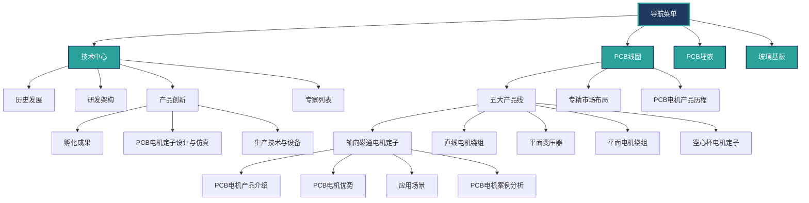

# 网站导航菜单层级结构图

## 菜单层级概览

```
导航菜单
│
├─ 技术中心 (Level 1)
│  ├─ 历史发展 (Level 2)
│  ├─ 研发架构 (Level 2)
│  ├─ 产品创新 (Level 2)
│  │  ├─ 孵化成果 (Level 3)
│  │  ├─ PCB电机定子设计与仿真 (Level 3)
│  │  └─ 生产技术与设备 (Level 3)
│  └─ 专家列表 (Level 2)
│
├─ PCB线圈 (Level 1)
│  ├─ 五大产品线 (Level 2)
│  │  ├─ 轴向磁通电机定子 (Level 3)
│  │  │  ├─ PCB电机产品介绍 (Level 4)
│  │  │  ├─ PCB电机优势 (Level 4)
│  │  │  ├─ 应用场景 (Level 4)
│  │  │  └─ PCB电机案例分析 (Level 4)
│  │  ├─ 直线电机绕组 (Level 3)
│  │  ├─ 平面变压器 (Level 3)
│  │  ├─ 平面电机绕组 (Level 3)
│  │  └─ 空心杯电机定子 (Level 3)
│  ├─ 专精市场布局 (Level 2)
│  └─ PCB电机产品历程 (Level 2)
│
├─ PCB埋嵌 (Level 1)
│
└─ 玻璃基板 (Level 1)
```

## Mermaid 流程图



## 层级统计

### Level 1（顶级菜单）：4 项
- 技术中心
- PCB线圈
- PCB埋嵌
- 玻璃基板

### Level 2（二级菜单）：7 项
- 历史发展
- 研发架构
- 产品创新
- 专家列表
- 五大产品线
- 专精市场布局
- PCB电机产品历程

### Level 3（三级菜单）：8 项
- 孵化成果
- PCB电机定子设计与仿真
- 生产技术与设备
- 轴向磁通电机定子
- 直线电机绕组
- 平面变压器
- 平面电机绕组
- 空心杯电机定子

### Level 4（四级菜单）：4 项
- PCB电机产品介绍
- PCB电机优势
- 应用场景
- PCB电机案例分析

## 路由路径映射

### 技术中心
- `/tech-center/product-innovation/incubation-achievements` - 孵化成果
- `/tech-center/product-innovation/simulation-design` - PCB电机定子设计与仿真
- `/tech-center/product-innovation#production-technology` - 生产技术与设备

### PCB线圈
- `/pcb-coil-axial/pcb-motor-intro` - PCB电机产品介绍
- `/pcb-coil-axial/pcb-motor-advantages` - PCB电机优势
- `/pcb-coil-axial/application-scenes` - 应用场景
- `/pcb-coil-axial/case-study` - PCB电机案例分析
- `/pcb-coil-linear-winding` - 直线电机绕组
- `/pcb-coil-planar-transformer` - 平面变压器
- `/pcb-coil-planar-winding` - 平面电机绕组
- `/pcb-coil-hollow-cup-stator` - 空心杯电机定子
- `/pcb-coil-market-layout` - 专精市场布局
- `/pcb-coil-product-journey` - PCB电机产品历程

### PCB埋嵌
- `/pcb-embedded` - PCB埋嵌

### 玻璃基板
- `/glass-substrate` - 玻璃基板

